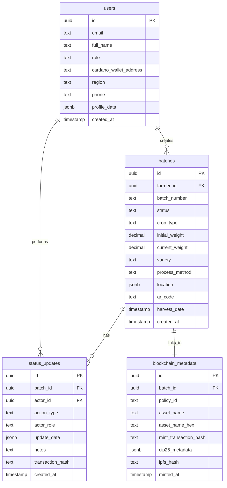

# Ethio-Origin Supabase Backend Setup Guide

## Table of Contents
1. [Database Schema](#database-schema)
2. [Initial Supabase Setup](#initial-supabase-setup)
3. [SQL Migration Scripts](#sql-migration-scripts)
4. [Row Level Security (RLS) Policies](#row-level-security-rls-policies)
5. [Frontend Integration](#frontend-integration)
6. [Environment Variables](#environment-variables)

---

## Database Schema

### Overview
The schema supports the farm-to-market supply chain with these core entities:
- **Users** - Farmers, processors, and consumers with Cardano wallet addresses
- **Batches** - The harvest/product units tracked on blockchain
- **Status Updates** - The journey/audit trail of each batch
- **Blockchain Metadata** - Links to on-chain data

### Entity Relationship Diagram



---

## Initial Supabase Setup

### Step 1: Create Supabase Project

1. Go to [supabase.com](https://supabase.com)
2. Click **"New Project"**
3. Fill in project details:
   - **Name:** `ethio-origin-backend`
   - **Database Password:** Generate a strong password (save this!)
   - **Region:** Choose closest to Ethiopia (e.g., `eu-central-1`)
4. Click **"Create new project"**
5. Wait 2-3 minutes for provisioning

### Step 2: Save Your Credentials

Once created, go to **Settings > API** and save:
- **Project URL** (e.g., `https://xxxxx.supabase.co`)
- **Anon/Public Key** (starts with `eyJh...`)
- **Service Role Key** (starts with `eyJh...`) - **Keep this secret!**

---

## SQL Migration Scripts

### Step 3: Run Database Migrations

Go to **SQL Editor** in Supabase dashboard and run these scripts in order:

#### Migration 1: Create Users Table

```sql
-- Enable UUID extension
CREATE EXTENSION IF NOT EXISTS "uuid-ossp";

-- Create users table
CREATE TABLE public.users (
    id UUID PRIMARY KEY DEFAULT uuid_generate_v4(),
    email TEXT UNIQUE,
    full_name TEXT NOT NULL,
    role TEXT NOT NULL CHECK (role IN ('farmer', 'processor', 'consumer')),
    cardano_wallet_address TEXT UNIQUE,
    region TEXT,
    phone TEXT,
    profile_image_url TEXT,
    profile_data JSONB DEFAULT '{}'::jsonb,
    created_at TIMESTAMP WITH TIME ZONE DEFAULT NOW(),
    updated_at TIMESTAMP WITH TIME ZONE DEFAULT NOW()
);

-- Create index on wallet address for faster lookups
CREATE INDEX idx_users_wallet ON users(cardano_wallet_address);
CREATE INDEX idx_users_role ON users(role);

COMMENT ON TABLE public.users IS 'All users in the supply chain (farmers, processors, consumers)';
```

#### Migration 2: Create Batches Table

```sql
-- Create batches table
CREATE TABLE public.batches (
    id UUID PRIMARY KEY DEFAULT uuid_generate_v4(),
    farmer_id UUID NOT NULL REFERENCES users(id) ON DELETE CASCADE,
    batch_number TEXT UNIQUE NOT NULL,
    status TEXT NOT NULL DEFAULT 'harvested' CHECK (status IN (
        'harvested', 
        'processing', 
        'processed', 
        'in_transit', 
        'delivered', 
        'retail'
    )),
    crop_type TEXT NOT NULL,
    initial_weight DECIMAL(10, 2) NOT NULL,
    current_weight DECIMAL(10, 2) NOT NULL,
    variety TEXT,
    process_method TEXT,
    grade TEXT,
    elevation TEXT,
    location JSONB NOT NULL, -- {lat, lng, gps_string, region}
    qr_code TEXT UNIQUE NOT NULL,
    harvest_date TIMESTAMP WITH TIME ZONE NOT NULL,
    created_at TIMESTAMP WITH TIME ZONE DEFAULT NOW(),
    updated_at TIMESTAMP WITH TIME ZONE DEFAULT NOW()
);

-- Create indexes
CREATE INDEX idx_batches_farmer ON batches(farmer_id);
CREATE INDEX idx_batches_status ON batches(status);
CREATE INDEX idx_batches_qr ON batches(qr_code);
CREATE INDEX idx_batches_batch_number ON batches(batch_number);

-- Create function to auto-generate batch numbers
CREATE OR REPLACE FUNCTION generate_batch_number()
RETURNS TEXT AS $$
DECLARE
    new_number TEXT;
BEGIN
    new_number := 'BATCH-' || TO_CHAR(NOW(), 'YYYYMMDD') || '-' || LPAD(FLOOR(RANDOM() * 10000)::TEXT, 4, '0');
    RETURN new_number;
END;
$$ LANGUAGE plpgsql;

COMMENT ON TABLE public.batches IS 'Product batches tracked through the supply chain';
```

#### Migration 3: Create Status Updates Table

```sql
-- Create status_updates table
CREATE TABLE public.status_updates (
    id UUID PRIMARY KEY DEFAULT uuid_generate_v4(),
    batch_id UUID NOT NULL REFERENCES batches(id) ON DELETE CASCADE,
    actor_id UUID NOT NULL REFERENCES users(id) ON DELETE CASCADE,
    action_type TEXT NOT NULL CHECK (action_type IN (
        'HARVESTED',
        'PROCESSING_STARTED',
        'PROCESSING_COMPLETE',
        'QUALITY_CHECKED',
        'IN_TRANSIT',
        'DELIVERED',
        'RETAIL_READY'
    )),
    actor_role TEXT NOT NULL,
    update_data JSONB DEFAULT '{}'::jsonb, -- Store weights, scores, etc.
    notes TEXT,
    transaction_hash TEXT, -- Cardano transaction hash
    location JSONB,
    created_at TIMESTAMP WITH TIME ZONE DEFAULT NOW()
);

-- Create indexes
CREATE INDEX idx_status_updates_batch ON status_updates(batch_id);
CREATE INDEX idx_status_updates_actor ON status_updates(actor_id);
CREATE INDEX idx_status_updates_created ON status_updates(created_at DESC);

COMMENT ON TABLE public.status_updates IS 'Audit trail of all batch movements and updates';
```

#### Migration 4: Create Blockchain Metadata Table

```sql
-- Create blockchain_metadata table
CREATE TABLE public.blockchain_metadata (
    id UUID PRIMARY KEY DEFAULT uuid_generate_v4(),
    batch_id UUID UNIQUE NOT NULL REFERENCES batches(id) ON DELETE CASCADE,
    policy_id TEXT NOT NULL,
    asset_name TEXT NOT NULL,
    asset_name_hex TEXT NOT NULL,
    mint_transaction_hash TEXT UNIQUE NOT NULL,
    cip25_metadata JSONB NOT NULL, -- The full CIP-25 JSON
    ipfs_hash TEXT, -- Future: IPFS content hash
    ipfs_metadata JSONB, -- Future: Additional IPFS data
    minted_at TIMESTAMP WITH TIME ZONE DEFAULT NOW()
);

-- Create indexes
CREATE INDEX idx_blockchain_batch ON blockchain_metadata(batch_id);
CREATE INDEX idx_blockchain_policy ON blockchain_metadata(policy_id);
CREATE INDEX idx_blockchain_tx ON blockchain_metadata(mint_transaction_hash);

COMMENT ON TABLE public.blockchain_metadata IS 'Links batches to Cardano blockchain assets';
```

#### Migration 5: Create Views (Optional but helpful)

```sql
-- View: Batch with Farmer Details
CREATE VIEW batch_details AS
SELECT 
    b.*,
    u.full_name AS farmer_name,
    u.cardano_wallet_address AS farmer_wallet,
    u.region AS farmer_region,
    u.profile_image_url AS farmer_photo,
    bm.policy_id,
    bm.asset_name,
    bm.mint_transaction_hash,
    COUNT(su.id) AS update_count
FROM batches b
LEFT JOIN users u ON b.farmer_id = u.id
LEFT JOIN blockchain_metadata bm ON b.id = bm.batch_id
LEFT JOIN status_updates su ON b.id = su.batch_id
GROUP BY b.id, u.id, bm.id;

COMMENT ON VIEW batch_details IS 'Complete batch information with farmer and blockchain data';
```

#### Migration 6: Create Triggers

```sql
-- Trigger to auto-update updated_at timestamp
CREATE OR REPLACE FUNCTION update_updated_at_column()
RETURNS TRIGGER AS $$
BEGIN
    NEW.updated_at = NOW();
    RETURN NEW;
END;
$$ LANGUAGE plpgsql;

CREATE TRIGGER update_users_updated_at
    BEFORE UPDATE ON users
    FOR EACH ROW
    EXECUTE FUNCTION update_updated_at_column();

CREATE TRIGGER update_batches_updated_at
    BEFORE UPDATE ON batches
    FOR EACH ROW
    EXECUTE FUNCTION update_updated_at_column();
```

---

## Row Level Security (RLS) Policies

### Step 4: Enable RLS and Create Policies

```sql
-- Enable RLS on all tables
ALTER TABLE public.users ENABLE ROW LEVEL SECURITY;
ALTER TABLE public.batches ENABLE ROW LEVEL SECURITY;
ALTER TABLE public.status_updates ENABLE ROW LEVEL SECURITY;
ALTER TABLE public.blockchain_metadata ENABLE ROW LEVEL SECURITY;

-- Users table policies
-- Anyone can read user profiles (public info)
CREATE POLICY "Users are viewable by everyone"
    ON users FOR SELECT
    USING (true);

-- Users can update their own profile
CREATE POLICY "Users can update own profile"
    ON users FOR UPDATE
    USING (auth.uid() = id);

-- Batches table policies
-- Everyone can view batches (for consumer verification)
CREATE POLICY "Batches are viewable by everyone"
    ON batches FOR SELECT
    USING (true);

-- Only farmers can create batches
CREATE POLICY "Farmers can create batches"
    ON batches FOR INSERT
    WITH CHECK (
        EXISTS (
            SELECT 1 FROM users 
            WHERE id = auth.uid() 
            AND role = 'farmer'
        )
    );

-- Farmers can update their own batches
CREATE POLICY "Farmers can update own batches"
    ON batches FOR UPDATE
    USING (farmer_id = auth.uid());

-- Status updates policies
-- Everyone can view status updates
CREATE POLICY "Status updates are viewable by everyone"
    ON status_updates FOR SELECT
    USING (true);

-- Authenticated users can create status updates
CREATE POLICY "Authenticated users can create status updates"
    ON status_updates FOR INSERT
    WITH CHECK (auth.uid() IS NOT NULL);

-- Blockchain metadata policies
-- Everyone can view blockchain metadata
CREATE POLICY "Blockchain metadata is viewable by everyone"
    ON blockchain_metadata FOR SELECT
    USING (true);

-- Only authenticated users can insert blockchain metadata
CREATE POLICY "Authenticated users can create blockchain metadata"
    ON blockchain_metadata FOR INSERT
    WITH CHECK (auth.uid() IS NOT NULL);
```

> **Note:** For the MVP, we're using permissive policies. In production, you'd want stricter role-based policies.

---

## Frontend Integration

### Step 5: Install Supabase Client

```bash
npm install @supabase/supabase-js
```

### Step 6: Create Supabase Client Configuration

Create `src/lib/supabase.ts`:

```typescript
import { createClient } from '@supabase/supabase-js';

const supabaseUrl = import.meta.env.VITE_SUPABASE_URL;
const supabaseAnonKey = import.meta.env.VITE_SUPABASE_ANON_KEY;

if (!supabaseUrl || !supabaseAnonKey) {
  throw new Error('Missing Supabase environment variables');
}

export const supabase = createClient(supabaseUrl, supabaseAnonKey);
```

### Step 7: Create API Service Layer

Create `src/services/api.ts` - See full implementation in the repository.

---

## Environment Variables

### Step 8: Configure Environment Variables

Create `.env.local` in your project root:

```env
# Supabase Configuration
VITE_SUPABASE_URL=https://your-project-id.supabase.co
VITE_SUPABASE_ANON_KEY=your-anon-key-here

# Optional: For future Cardano integration
VITE_CARDANO_NETWORK=preprod
```

**Add to `.gitignore`:**
```
.env.local
.env
```

---

## Next Steps

### Phase 1: Basic CRUD Operations
1. ✅ Set up Supabase project
2. ✅ Run migrations
3. ✅ Configure RLS policies
4. ✅ Install client library
5. Replace mock data in components with Supabase API calls

### Phase 2: Cardano Integration
1. Integrate MeshJS for wallet connection
2. Create minting service
3. Store blockchain metadata
4. Link batches to on-chain assets

### Phase 3: Real-time Features
1. Add Supabase real-time subscriptions
2. Implement live tracking dashboard
3. Add notifications

---

## Resources

- [Supabase Documentation](https://supabase.com/docs)
- [Supabase JavaScript Client](https://supabase.com/docs/reference/javascript/introduction)
- [Row Level Security Guide](https://supabase.com/docs/guides/auth/row-level-security)

---

**Estimated integration time:** 1-2 days to replace all mock data with real Supabase calls.
